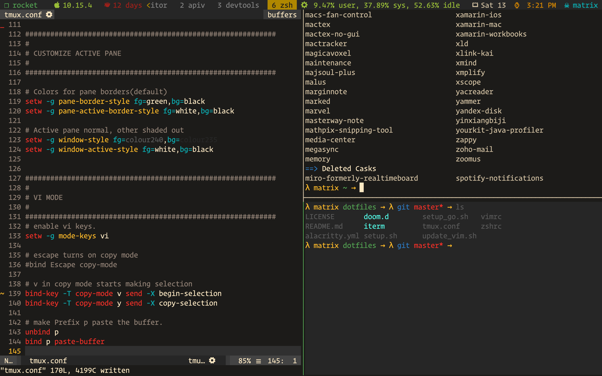

# dotfiles

## Install the basics

  ```bash
    git clone https://github.com/mrprofessor/dotfiles.git
    cd ~/dotfiles
    bash setup.sh

    # To install programming langs and tools run
    sh pl.sh
  ```

## Screenshots

<kbd>
  
</kbd>

## TODO

 - Add an interactive installation method(preferably in python).
 - Use gnu stow to manage dotfiles.
